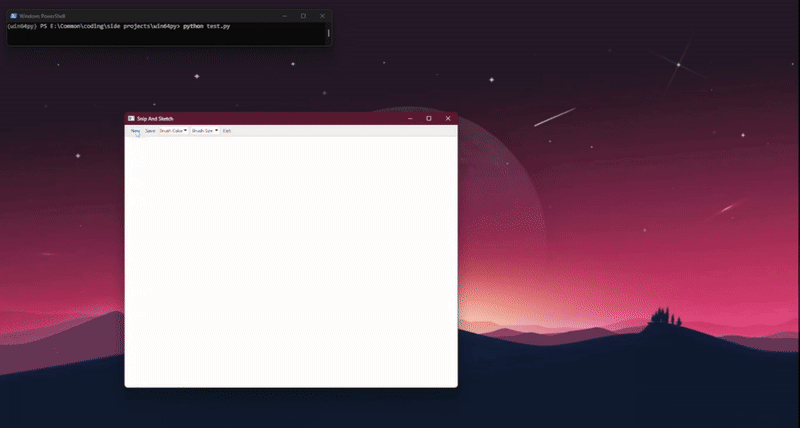
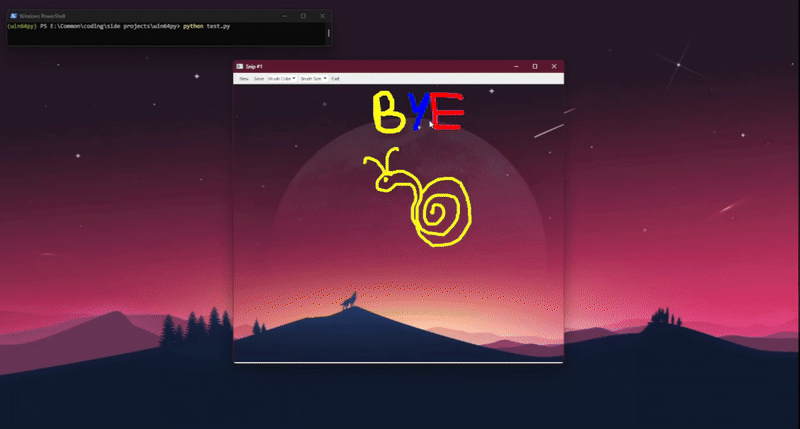

## Screenshot tool (win64py)
It is a part of a larger package named win64py which aims to simplify and add extra functionalities to already existing features in python.
This module is about Screenshot tool with Annotating option.

<h2>Features: </h2>

<ul>
  <li><b>Taking a Snip: </b></li>
  
  

  <li><b>Painting/Anotating: </b></li>

  

  <li><b>Saving: </b></li>

  
</ul>

<h2>Installation: </h2>

```bash
git clone https://github.com/bp2881/win64py.git
cd win64py
pip install -r requirements.txt
```

<h2>Usage: </h2>

```python
from Snipper import Snip

Snip.Brush()
```

<h3>Author: </h3>
bp2881 (Pranav) - <a href="https://github.com/bp2881/">github</a>, <a href="https://www.linkedin.com/in/pranav-bairy-387163359/">linkedin</a>
